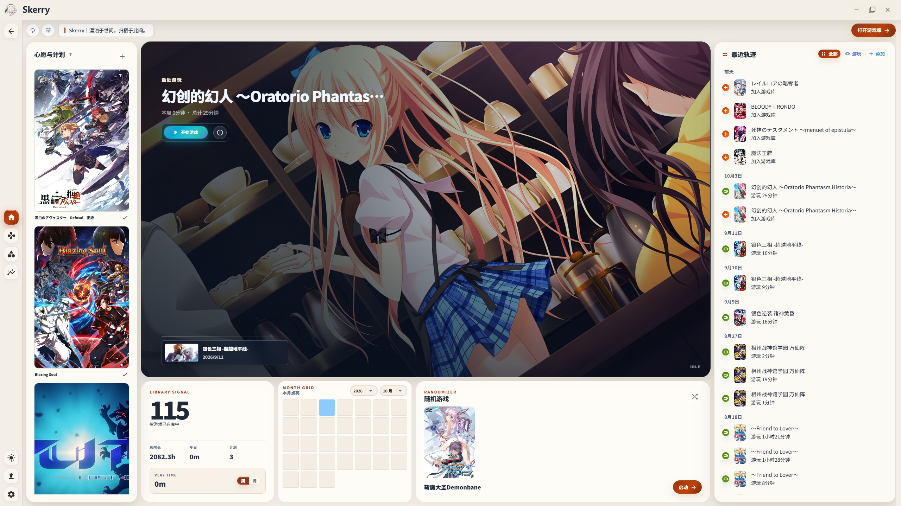
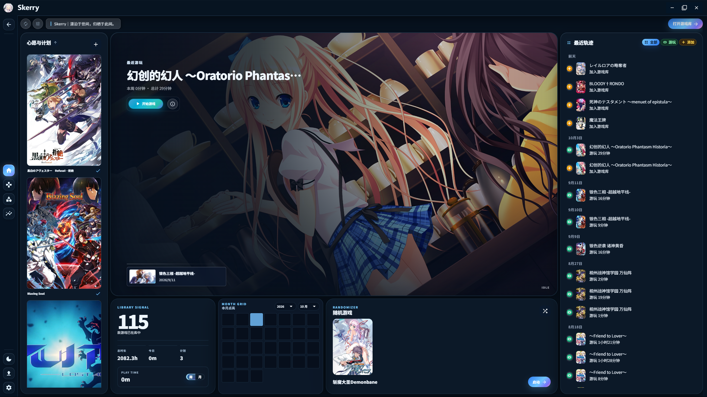
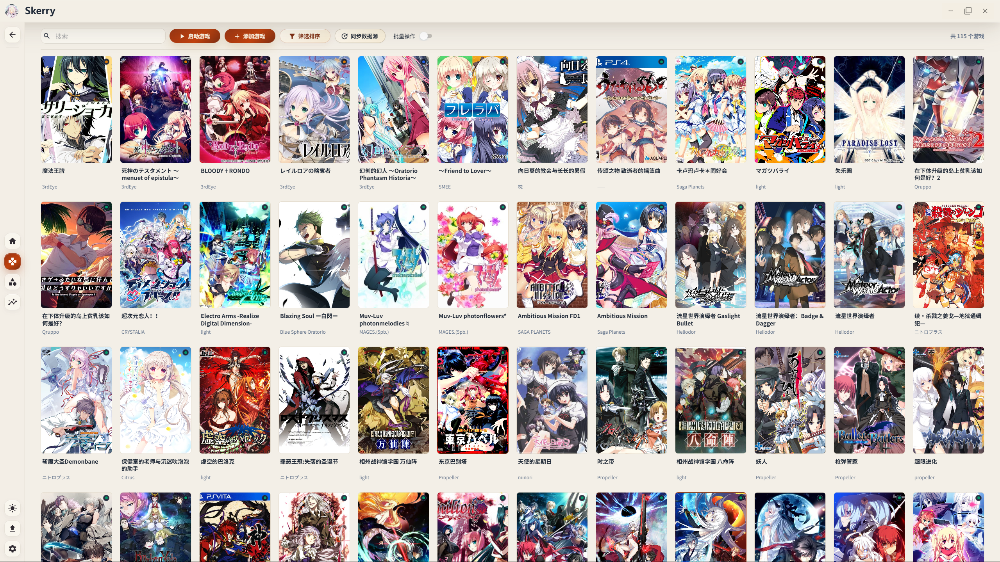
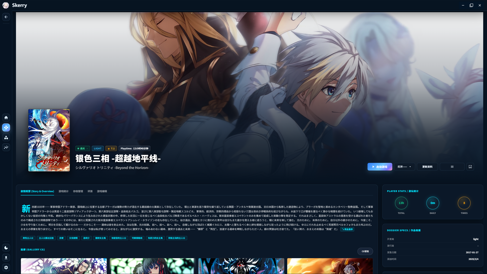
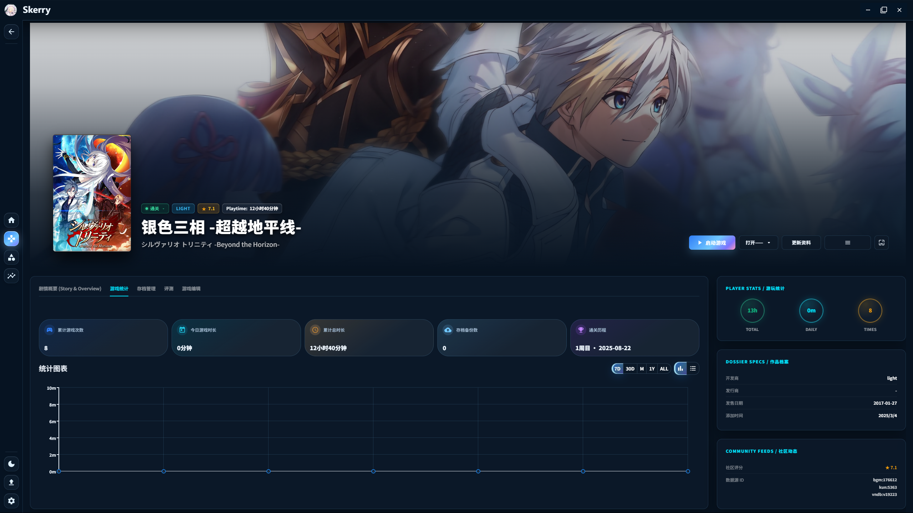
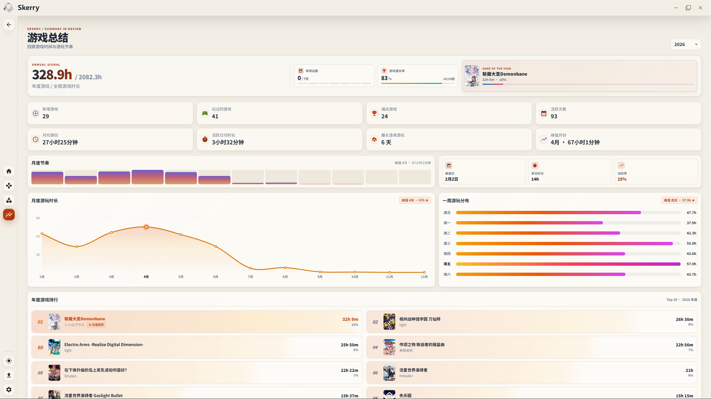
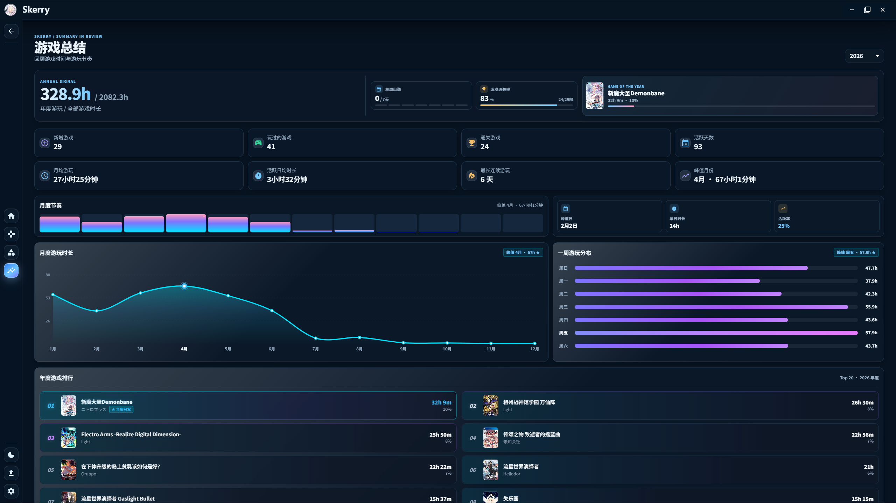
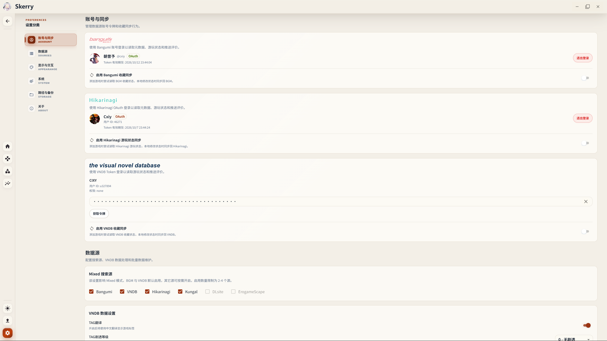

<div align="center">

# Skerry

**纯粹、高颜值的视觉小说 (Galgame) 本地启动器与生涯管理工具**


[](https://www.gnu.org/licenses/agpl-3.0)
[](https://tauri.app/)
[](https://react.dev/)
[](https://www.typescriptlang.org/)
[](https://www.rust-lang.org/)

</div>

---

### ⚠️ 二创与开源声明

- 本工具基于开源项目 [ReinaManager](https://github.com/huoshen80/ReinaManager)（遵循 **AGPL-3.0** 协议）进行二次开发与重构，源代码完全公开。
- 感谢原作者提供的架构基础，也感谢 [PotatoVN](https://github.com/GoldenPotato137/PotatoVN) 带来的生态灵感，本工具保留了对 PotatoVN 数据的无痛导入支持。
- 为避免与官方原版混淆并尊重原作，二创版本独立命名为 **Skerry**。

---

## 闲聊几句

首先说明，为了好看占用会高一点，我先前尝试过基于别的底层构建，但是最终的效果都差点意思，也是我自己技术力不到位了。

本身是我自己出于无聊的产物，我说多不多说少不少用过不少管理器，但是总觉得差点意思，所以才想造一个偏我个人习惯的。

功能上跟一般的启动器没多大区别，统计、计时、LE / Magpie / 转区启动等，我只是大改了前端的 UI，改成我自己喜欢的样式。

---

## 首页

首页 C 位由上次游玩的大卡片居中，下方小卡片是上上次游玩的作品；  
心愿计划属于想玩，但是不计入游戏库，等到同步本地文件夹之后会自动入库；  
新增本月点亮卡片，分 6 种色阶，能清晰看清楚当月游玩分布情况。

<p align="center">
  
  
</p>

---

## 游戏库

游戏库的封面卡片没加什么特效，只有一圈鼠标悬停的高亮。

<p align="center">
  
</p>

---

## 游戏详细页

首页和游戏详细页的变化是最大的，因为我不喜欢看标签，感觉不如 CG 来的更有画面感，所以详细页加入了横幅图和画廊，其他的东西大差不差。

<p align="center">
  
  
</p>

详细页也保留原 ReinaManager 的统计图表，新增了标注通关日期：

<p align="center">
  
</p>

---

## 游戏总结（年度报告）

主要变化是游戏总结，加入了年度、全部年份的游戏时长、通关数、出勤数、月度与周游玩等等统计总结，以及年度游戏排行榜。8月份我改的时候源 ReinaManager 还没这个功能，当时本来是看 PotatoVN 来的灵感加的。

<p align="center">
  
  
</p>

---

## 账号与数据源

大多是继承 ReinaManager 的，没动什么地方。

<p align="center">
  
</p>

其他方面跟一般的启动器没什么太大区别，只是 UI 好看。

---

## 🛠️ 本地编译与运行

如果你想自己从源码编译：

```bash
# 1. 安装前端依赖
pnpm install

# 2. 本地开发调试运行
pnpm tauri dev

# 3. 编译正式安装包
pnpm tauri build
```
